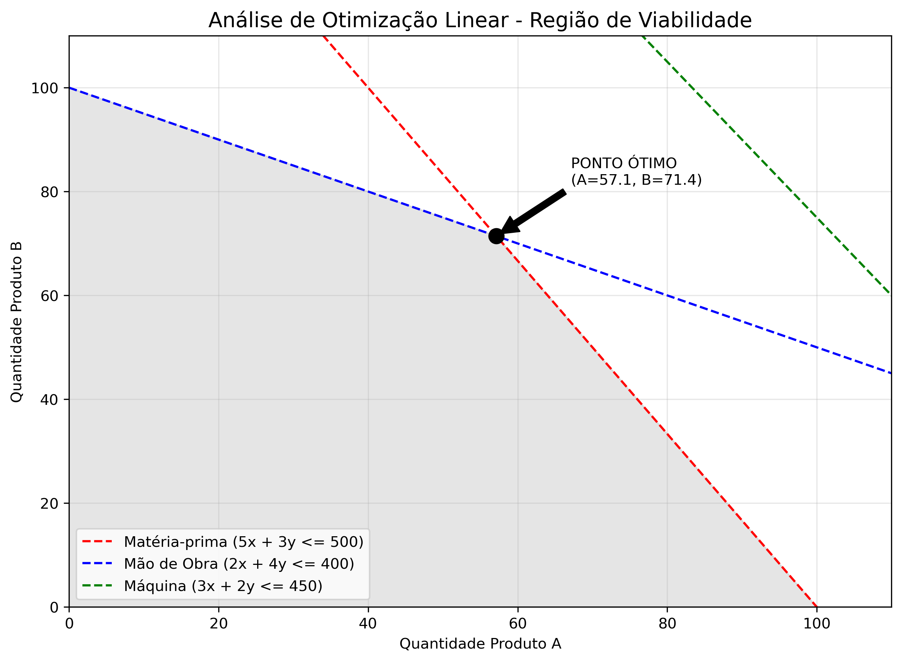

# 📈 Otimização de Produção Industrial (Simplex)

Este projeto utiliza Programação Linear para maximizar o lucro de uma linha de produção, respeitando restrições de insumos e tempo.

## 📊 Região de Viabilidade
Abaixo está o gráfico gerado pelo script Python, identificando o ponto ótimo de produção:

## 🛠️ Tecnologias
* **Python 3.13** (PuLP, Matplotlib, Numpy)
* **Jupyter Notebook** para prototipagem e análise.
